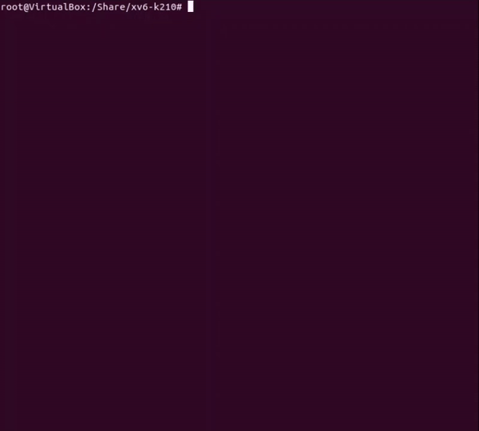

# Peking University OS Labs — xv6-k210

北京大学操作系统课程内核实验个人实现，基于 [`xv6-k210`](https://github.com/SKTT1Ryze/xv6-k210) 框架。

在 RISC-V64 架构与 FAT32 文件系统的基础上，从系统调用自举出发，循序渐进地实现了进程管理、内存管理、调度算法、内存优化、页面置换、文件系统与并发同步等操作系统核心子系统。

---

## 分支导航

各 Part 最终代码保存在独立分支中，通过页面左上角的 Branch 菜单切换查看。每个分支的 `README.md` 包含该 Part 的实现说明与注意事项。

| 分支 | Part | 主题 |
|---|---|---|
| `syscall` ← **当前默认分支** | Part 1 | initcode 64 位适配、基础系统调用 |
| `process` | Part 2 | clone 线程机制、wait4、内核时钟体系 |
| `mmap` | Part 3 | VMA 管理、mmap/munmap、缺页懒分配 |
| `sched` | Part 4 | Round-Robin、优先级调度、MLFQ |
| `cow` | Part 5 | 懒分配（Lazy Allocation）与写时复制（COW） |
| `swap` | Part 6 | 内存 Swap 区模拟、FIFO / LRU 页面置换 |
| `fs` | Part 7 | FAT32 进阶文件系统调用（getdents64 等） |
| `semaphore` | Part 8 | 内核级信号量 P/V、哲学家就餐问题 |

---

## Part 1：关机与系统调用

### 实现内容

- `initcode.S` 改写为 64 位兼容版本，新增 Makefile `dump` 目标自动生成 `initcode.h`
- 系统调用号对齐至 Linux 标准（`SYS_write`→64、`SYS_getpid`→172 等）
- 新增 `shutdown`、`getcwd`、`times`、`uname` 系统调用
- 修改 `init.c` 顺序执行测试程序后主动调用 `shutdown()` 关机

通过测试点：`test_getcwd` / `test_write` / `test_getpid` / `test_times` / `test_uname`

### ⚠️ 注意事项

**1. 修改 `sysnum.h` 后必须重新生成 `initcode.h`**

`initcode.S` 直接引用了 `SYS_exec` 和 `SYS_exit` 宏。每次修改调用号后，如果忘记执行 `make dump`，第一个进程会因调用号不匹配而报错：

```
pid 1 initcode: unknown sys call
```

建议将 `dump` 写入 `make all` 的依赖，避免遗忘。

**2. `getcwd` 的返回值语义**

Linux 标准要求 `getcwd` 成功时返回 `buf` 的地址（即用户传入的指针值），失败时返回 `NULL`（0）。xv6 原版实现成功时返回 0，测试程序会将返回值作为字符串指针使用，导致段错误。必须改为：

```c
return addr;  // 成功时返回 buf 地址，而非 0
```

**3. `wait` 退出状态码需左移 8 位**

POSIX 规定 `wait` 写出的 `status` 中，高 8 位为退出码，低 8 位为信号编号。测试程序用 `WEXITSTATUS(status)`（即右移 8 位）提取退出码，因此内核写入前必须先左移：

```c
int exit_status = np->xstate << 8;
```

**4. 多核启动概率性卡死**

原始 `Makefile` 中 `CPUS=2`，在 RustSBI 多核启动时存在并发竞态，表现为概率性卡死。改为 `CPUS=1` 后问题消失。

**5. 平台部署：`/init` 文件缺失**

在评测平台的 `sdcard.img` 中可能不存在 `/init` 文件，导致 `exec("/init")` 失败。解决方式是在 `Makefile` 中设置 `HARD_CODE_INIT=1`，将完整 `init` 程序机器码打入 `initcode.h`。

---

## 运行环境

| 组件 | 说明 |
|---|---|
| 评测镜像 | `docker.educg.net/cg/os-contest:2024p6` |
| 运行平台 | QEMU virt 机器（10 MHz 硬件时钟） |
| 引导固件 | RustSBI QEMU v0.2.0-alpha.2 |
| 内核框架 | xv6-k210（RISC-V64，FAT32） |
| 测试套件 | oscomp/testsuits-for-oskernel（main 分支） |
| 构建工具 | riscv64 GCC 工具链 + GNU Make |

```bash
make all   # 编译，产物重命名为 kernel-qemu 和 sbi-qemu
make run   # 在 QEMU 上启动内核
```
---

> *以下为 xv6-k210 官方框架的原始说明 / Below is the original README from the upstream xv6-k210 repository:*
# XV6-RISCV On K210
Run xv6-riscv on k210 board  
[English](./README.md) | [中文](./README_cn.md)   

```
 (`-')           (`-')                   <-.(`-')                            
 (OO )_.->      _(OO )                    __( OO)                            
 (_| \_)--.,--.(_/,-.\  ,--.    (`-')    '-'. ,--.  .----.   .--.   .----.   
 \  `.'  / \   \ / (_/ /  .'    ( OO).-> |  .'   / \_,-.  | /_  |  /  ..  \  
  \    .')  \   /   / .  / -.  (,------. |      /)    .' .'  |  | |  /  \  . 
  .'    \  _ \     /_)'  .-. \  `------' |  .   '   .'  /_   |  | '  \  /  ' 
 /  .'.  \ \-'\   /   \  `-' /           |  |\   \ |      |  |  |  \  `'  /  
`--'   '--'    `-'     `----'            `--' '--' `------'  `--'   `---''   
```

  

## Dependencies
+ `k210 board` or `qemu-system-riscv64`
+ RISC-V Toolchain: [riscv-gnu-toolchain](https://github.com/riscv/riscv-gnu-toolchain.git)

## Installation
```bash
git clone https://github.com/HUST-OS/xv6-k210
```

## Run on k210 board
First you need to connect your k210 board to your PC.  
And check the `USB serial port` (In my situation it will be `ttyUSB0`):  
```bash
ls /dev/ | grep USB
```
Build the kernel and user program:

```bash
cd xv6-k210
make build
```
Instead of the original file system, xv6-k210 runs with FAT32. You might need an SD card with FAT32 format.  
Your SD card should NOT keep a partition table. To start `shell` and other user programs, you need to copy them into your SD card.  
First, connect and mount your SD card (SD card reader required).
```bash
ls /dev/ # To check your SD device
mount <your SD device name> <mount point>
make sdcard dst="SD card mount point"
umount <mount point>
```
Then, insert the SD card to your k210 board and run:
```bash
make run
```
Sometimes you should change the `USB serial port`:  
```bash
make run k210-serialport=`Your-USB-port`(default by ttyUSB0)
```
Ps: Most of the k210-port in Linux is ttyUSB0, if you use Windows or Mac OS, this doc 
may help you: [maixpy-doc](https://maixpy.sipeed.com/zh/get_started/env_install_driver.html#)  

## Run on qemu-system-riscv64
First, make sure `qemu-system-riscv64` is installed on your system.  
Second, make a disk image file with FAT32 file system.
```bash
make fs
```
It will generate a disk image file `fs.img`, and compile some user programs like `shell` then copy them into the `fs.img`.  
As long as the `fs.img` exists, you don't need to do this every time before running, unless you want to update it.

Finally, start running.
```bash
make run platform=qemu
```

Ps: Press Ctrl + A then X to quit qemu.

## About shell

The shell commands are user programs, too. Those program should be put in a "/bin" directory in your SD card or the `fs.img`.  
Now we support a few useful commands, such as `cd`, `ls`, `cat` and so on.

In addition, `shell` supports some shortcut keys as below:

- Ctrl-H -- backspace  
- Ctrl-U -- kill a line  
- Ctrl-D -- end of file (EOF)  
- Ctrl-P -- print process list  

## Add my programs on xv6-k210
1. Make a new C source file in `xv6-user/` like `myprog.c`, and put your codes;
2. You can include `user.h` to use the functions declared in it, such as `open`, `gets` and `printf`;
3. Add a line "`$U/_myprog\`" in `Makefile` as below:
    ```Makefile
    UPROGS=\
        $U/_init\
        $U/_sh\
        $U/_cat\
        ...
        $U/_myprog\      # Don't ignore the leading '_'
    ```
4. Then make:
    ```bash
    make userprogs
    ```
    Now you might see `_myprog` in `xv6-user/` if no error detected. Finally you need to copy it into your SD (see [here](#run-on-k210-board))
     or FS image (see [here](#run-on-qemu-system-riscv64)).

## Progress
- [x] Multicore boot
- [x] Bare-metal printf
- [x] Memory alloc
- [x] Page Table
- [x] Timer interrupt
- [x] S mode extern interrupt
- [x] Receive uarths message
- [x] SD card driver
- [x] Process management
- [x] File system
- [x] User program
- [X] Steady keyboard input(k210)

## TODO
Fix the bugs of U-mode exception on k210.

